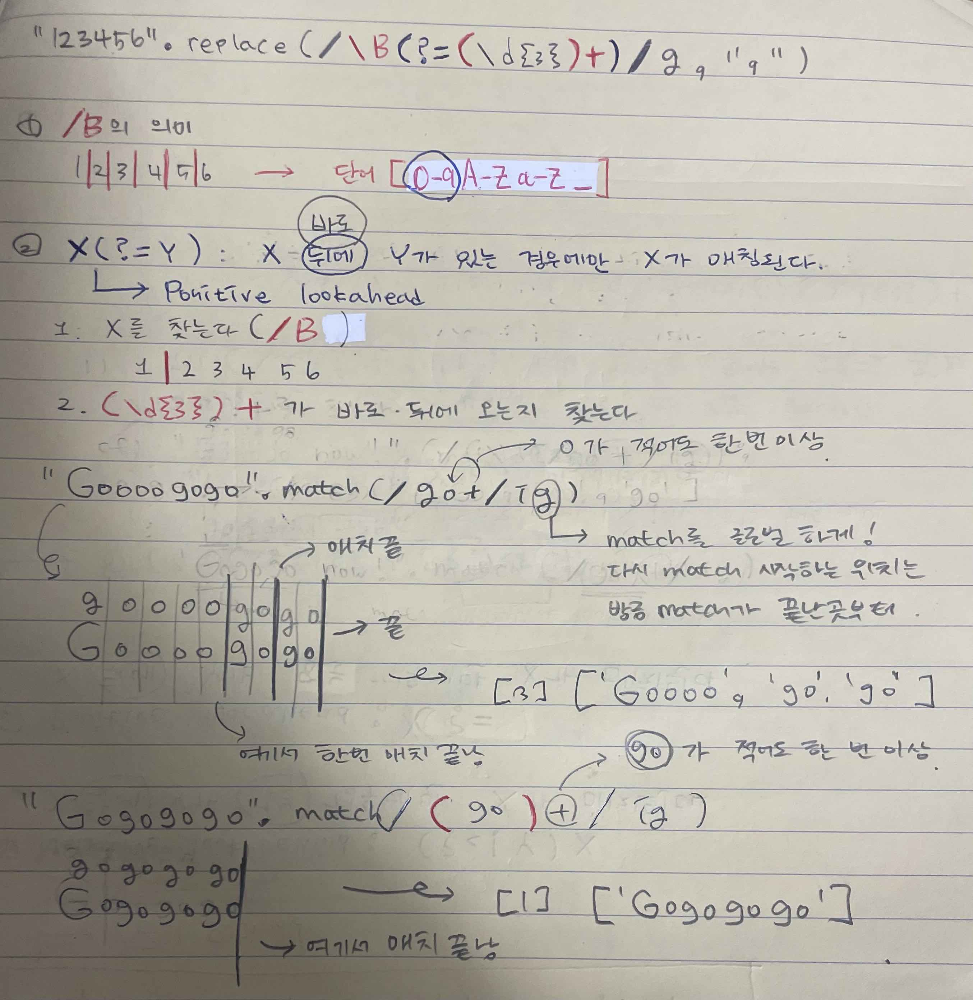
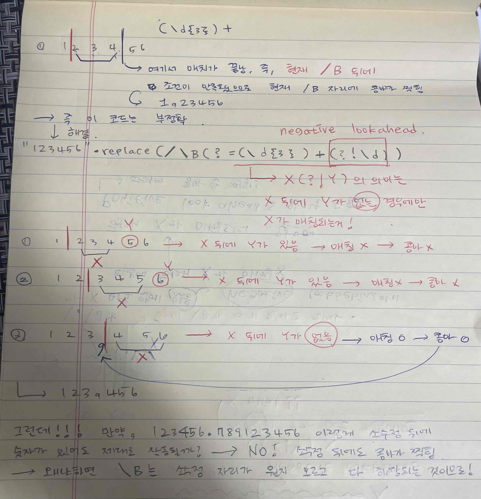
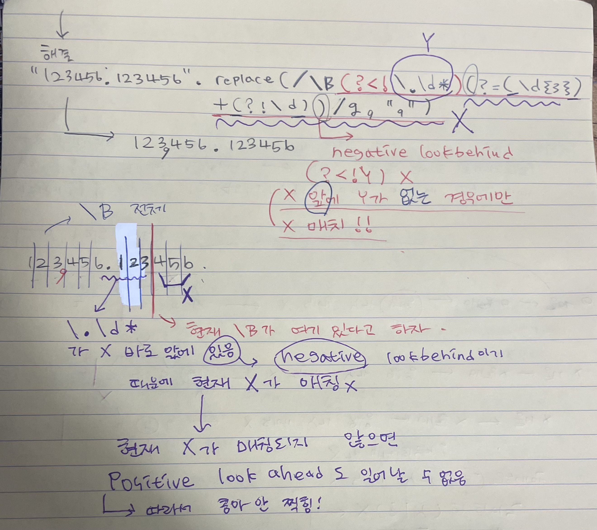
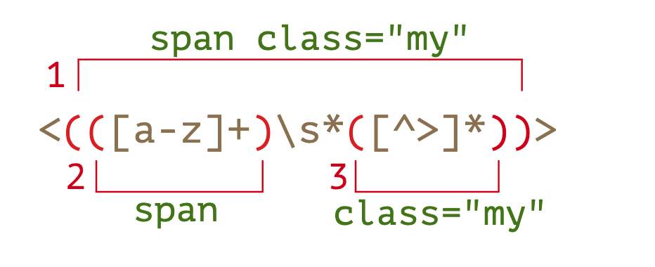

원범이는 편의점 아르바이트가 끝난 후 정산을 하고자 합니다.
정산을 빨리하고 집에 가고 싶은 원범이는 프로그램을 만들려고 합니다.

숫자를 입력받고 천 단위로 콤마(,)를 찍어주세요.

예를 들어, 123456789를 입력받았으면 123,456,789를 출력해야 합니다.
## 접근 방향 - 1
정규 표현식 이용
[참고 사이트](https://hianna.tistory.com/441)
### 내 코드
```js
function thousandComma(num){
    return num.toString().replace(/\B(?<!\.\d*)(?=(\d{3})+(?!\d))/g, ",");
}

thousandComma(123456789);
```
### 해설



### 문제점
브라우저 호환성

## 접근 방향 - 2
* for문
* 뒤에서부터 거꾸로 돌면서 콤마 추가하기
* 그런데 추가하면서 문자열의 길이가 늘어나기 때문에 인덱스에 영향을 미칠거임
* 인덱스가 늘어나는 거 계산
    숫자|길이|콤마 삽입 인덱스
    |:--:|:--:|:--:|
    |12345678912345|14|-3|
    |12345678912,345|15|-7|
    |12345678,912,345|16|-11|
    |12345,678,912,345|17|-15|
    |12,345,678,912,345|18|.|

    형태를 보면 인덱스가 ```-3-4n``` 형태임
### 내 코드
```js
let a = 123456789;
let b = String(a).split('');
for (let i = 0; i > -b.length; i--){
    if ((-i - 3) % 4 === 0){
        b.splice(i, 0, ',');
    }
}
b.join('');
```
## 정규 표현식 개념
1. [Quantifiers](https://javascript.info/regexp-quantifiers)
    * ```{n}```
        * ```\d{n}``` denotes **exactly** ```n``` digits, the same as ```\d\d\d```.
            ```js
            '+7(903)-123-45-67'.match(/\d{3}/g)
            // (2) ['903', '123']
            ```
        * ```d{n, }``` looks for sequences of digits of length ```n``` or more
            ```js
            '+7(903)-123-45-67'.match(/\d/g)
            // (11) ['7', '9', '0', '3', '1', '2', '3', '4', '5', '6', '7']

            '+7(903)-123-45-67'.match(/\d{1,}/g)
            // (5) ['7', '903', '123', '45', '67']

            '+7(903)-123-45-67'.match(/\d{3,}/g)
            // (2) ['903', '123']
            ```
    * ```+```
        * Means “one or more”, the same as ```{1,}```.
            ```js
            '+7(903)-123-45-67'.match(/\d+/g)
            // (5) ['7', '903', '123', '45', '67']
            ```
    * ```?```
        * Means “zero or one”, the same as ```{0,1}```.
        * For instance, the pattern ```ou?r``` looks for ```o``` followed by zero or one ```u```, and then ```r```.
            ```js
            "Should I write color or colour?".match(/colou?r/g)
            // (2) ['color', 'colour']
            ```
    * ```*```
        * Means “zero or more”, the same as ```{0,}```. That is, the character may repeat any times or be absent.
        * \d0* looks for a digit followed by any number of zeroes (may be many or none)
            ```js
            "100 10 1".match(/\d0*/g)
            // (3) ['100', '10', '1']

            "100 10 1".match(/\d0+/g)
            // 100, 10
            // 1 not matched, as 0+ requires at least one zero
            ```
    * 예제
        * ```\d+\.\d+```: Regexp for a number with a floating point
            ```js
            "0 1 12.345 7890".match(/\d+\.\d+/g)
            // ['12.345']
            // 소수점 앞에 한 개 이상의 숫자가 오고 소수점 뒤에 한 개 이상의 숫자가 오는거 찾기
            ```
2. [Greedy and lazy quantifiers](https://javascript.info/regexp-greedy-and-lazy)
    * Greed search
        ```js
        let regexp = /".+"/g;
        let str = 'a "witch" and her "broom" is one';
        alert( str.match(regexp) ); // "witch" and her "broom"
        ```
    * lazy search
        ```js
        let regexp = /".+?"/g;
        let str = 'a "witch" and her "broom" is one';
        alert( str.match(regexp) ); // "witch", "broom"
        ```
3. [Capturing groups](https://javascript.info/regexp-groups)
    * effects
        1. It allows to get a part of the match as a separate item in the result array.
        2. If we put a quantifier after the parentheses, it applies to the parentheses as a whole.
    * ```(go)+```

        Without parentheses, the pattern ```go+``` means ```g``` character, followed by ```o``` repeated one or more times. For instance, ```goooo``` or ```gooooooooo```.
        ```js
        'Gogogo now!'.match(/go+/ig)
        // (3) ['Go', 'go', 'go']
        ```
        If we put a quantifier after the parentheses, it applies to the parentheses as a whole.
        ```js
        'Gogogo now!'.match(/(go)+/ig)
        // ['Gogogo']
        ```
    * Nested groups
        
        ```js
        let str = '<span class="my">';

        let regexp = /<(([a-z]+)\s*([^>]*))>/;

        let result = str.match(regexp);
        alert(result[0]); // <span class="my">
        alert(result[1]); // span class="my"
        alert(result[2]); // span
        alert(result[3]); // class="my"
        ```
    * optional groups
        When we search for all matches (flag g), the match method does not return contents for groups.
        ```js
        let match = 'ac'.match(/a(z)?(c)?/)

        alert( match.length ); // 3
        alert( match[0] ); // ac (whole match)
        alert( match[1] ); // undefined, because there's nothing for (z)?
        alert( match[2] ); // c
        ```
4. [Look arounds](https://javascript.info/regexp-lookahead-lookbehind)
    * Lookahead: ```X(?=Y)```

        * look for ```X```, but match only if followed by ```Y```

        * Please note: the lookahead is merely a test, the contents of the parentheses (?=...) is not included in the result 30.
            ```js
            let str = "1 turkey costs 30€";

            alert( str.match(/\d+(?=€)/) ); // 30
            // the number 1 is ignored, as it's not followed by €
            ```

        * the regular expression engine finds X and then checks if there’s Y immediately after it. If it’s not so, then the potential match is skipped, and the search continues.
            ```md
            X(?=Y)(?=Z) means:

            1. Find X.
            2. Check if Y is immediately after X (skip if isn’t).
            3. Check if Z is also immediately after X (skip if isn’t).
            4. If both tests passed, then the X is a match, otherwise continue searching.

            such pattern means that we’re looking for X followed by Y and Z at the same time.
            ```
    * Negative lookahead: ```X(?!Y)```

        * search X, but only if not followed by Y

    * lookbehind: ```(?<=Y)X```
        * **Lookbehind browser compatibility**
            > Please Note: Lookbehind is not supported in non-V8 browsers, such as Safari, Internet Explorer.
        * matches X, but only if there’s Y before it.
        * example
            ```js
            let str = "1 turkey costs $30";

            // the dollar sign is escaped \$
            alert( str.match(/(?<=\$)\d+/) ); // 30 (skipped the sole number)
            ```
    * Negative lookbehind: ```(?<!Y)X```
        * **Lookbehind browser compatibility**
            > Please Note: Lookbehind is not supported in non-V8 browsers, such as Safari, Internet Explorer.
        * matches X, but only if there’s no Y before it.
        * example
            ```js
            let str = "2 turkeys cost $60";

            alert( str.match(/(?<!\$)\b\d+/g) ); // 2 (the price is not matched)
            ```
    * capturing groups
        * in the pattern ```\d+(?=€)```, the ```€``` sign doesn’t get captured as a part of the match. That’s natural: we look for a number ```\d+```, while ```(?=€)``` is just a test that it should be followed by ```€```. But in some situations we might want to capture the lookaround expression as well
            ```js
            let str = "1 turkey costs 30€";
            let regexp = /\d+(?=(€|kr))/; // extra parentheses around €|kr

            alert( str.match(regexp) ); // 30, €
            ```
5. [\B와 \b](https://ohgyun.com/392)
    * 단어: [a-zA-Z0-9_]
    * ```\b```
        * 단어의 경계 위치
    * ```\B```
        * ```\b```와 반대 개념